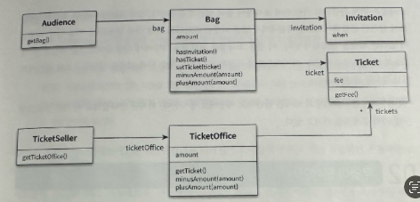

# 티켓 판매 애플리케이션 구현하기

소극장의 홍보 및 관람객의 유입을 위해 이벤트를 기획
- 시나리오
  - 추첨을 통해 선정된 관람객에게 공연을 무료로 관람 할 수 있는 초대장을 발송한다.
- 제약사항
  - 이벤트에 당첨된 관람객과, 그렇지 못한 관람객은 다른 방식으로 입장시켜야 한다.
  - 이벤트에 당첨된 관람객은 초대장을 티켓으로 교환 한 후에 입장 할 수 있다.
  - 이벤트에 당첨되지 않은 관람객은 티켓을 구매해야만 입장할 수 있다.
  - 입장전, 이벤트 당첨 여부를 확인해야 하고 이벤트 장첨자가 아닌 경우, 티켓을 판매한 후에 입장시켜야 한다.

### 초대장
- 공연을 관람 할 수 있는 초대 일자 를 가지고 있다.

### 티켓
- 공연을 관람하기 원하는 모든 사람들은 티켓을 소지하고 있다.

### 가방
- 관람객이 소지품을 보관할 수 있는 가방이다.
- 아래와 같은 소지품을 가질 수 있다.
  - 초대장
  - 티켓
  - 현금

### 관람객
- 관람객은 소지품을 보관하기 위해 가방을 소지 할 수 있다.

### 매표소
- 관람객이 소극장에 입장하기 위해서는 매표소에서 초대장을 티켓으로 교환하거나 구매해야 한다.
- 매표소에는 관람객에게 판매할 티켓과 티켓의 판매 금액이 보관돼 있어야 한다.

### 클래스 다이어그램
