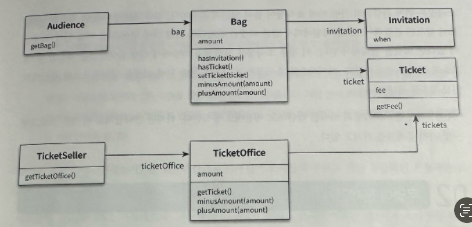
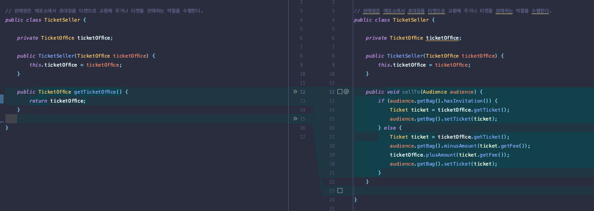
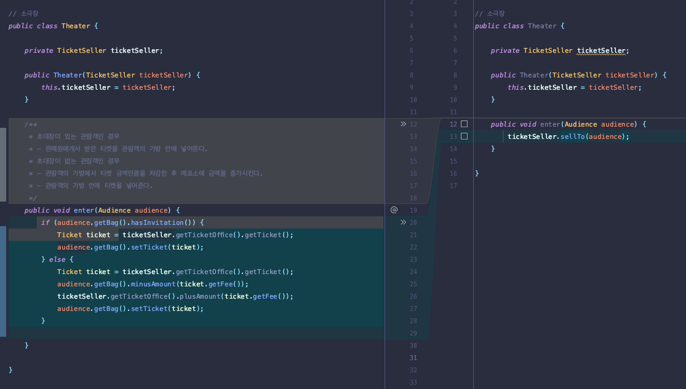
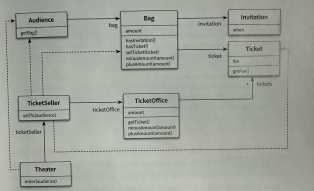
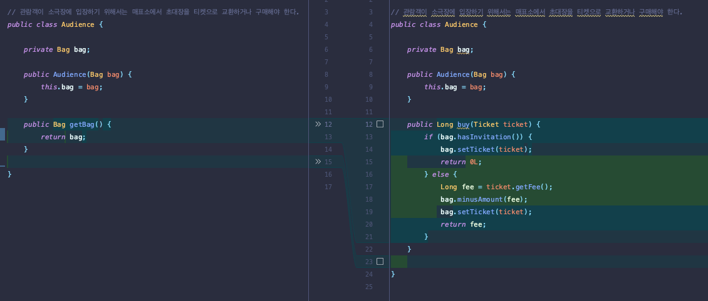
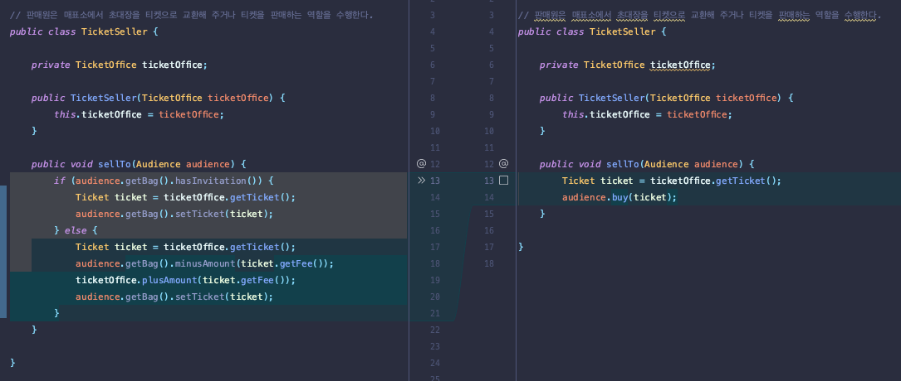
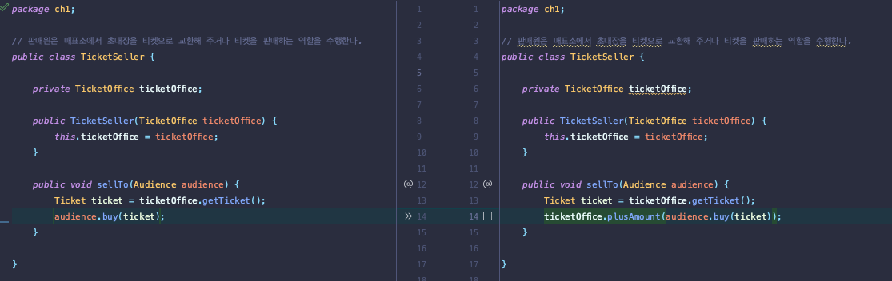
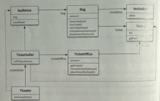

# 티켓 판매 애플리케이션 구현하기

소극장의 홍보 및 관람객의 유입을 위해 이벤트를 기획
- 시나리오
  - 추첨을 통해 선정된 관람객에게 공연을 무료로 관람 할 수 있는 초대장을 발송한다.
- 제약사항
  - 이벤트에 당첨된 관람객과, 그렇지 못한 관람객은 다른 방식으로 입장시켜야 한다.
  - 이벤트에 당첨된 관람객은 초대장을 티켓으로 교환 한 후에 입장 할 수 있다.
  - 이벤트에 당첨되지 않은 관람객은 티켓을 구매해야만 입장할 수 있다.
  - 입장전, 이벤트 당첨 여부를 확인해야 하고 이벤트 장첨자가 아닌 경우, 티켓을 판매한 후에 입장시켜야 한다.

### 초대장
- 공연을 관람 할 수 있는 초대 일자 를 가지고 있다.

### 티켓
- 공연을 관람하기 원하는 모든 사람들은 티켓을 소지하고 있다.

### 가방
- 관람객이 소지품을 보관할 수 있는 가방이다.
- 아래와 같은 소지품을 가질 수 있다.
  - 초대장
  - 티켓
  - 현금

### 관람객
- 관람객은 소지품을 보관하기 위해 가방을 소지 할 수 있다.

### 매표소
- 관람객이 소극장에 입장하기 위해서는 매표소에서 초대장을 티켓으로 교환하거나 구매해야 한다.
- 매표소에는 관람객에게 판매할 티켓과 티켓의 판매 금액이 보관돼 있어야 한다.

### 클래스 다이어그램

### 문제점
- 로버트 마틴은 소프트웨어 모듈이 가져야 하는 세 가지 목적으로 다음과 같이 꼽았다.
  - 실행 중에 제대로 동작할것
  - 변경을 위해 존재할것
  - 코드를 읽는 사람과 의사소통 할 것
- 마틴에 따르면 제대로 실행되고, 변경이 용이해야 하며, 이해하기 쉬어야 한다.
- 따라서 현재까지 의 기능은 제대로 실행됨을 만족하지만, 변경과 읽는사람과의 의사소통은 만족 시키지 못했다.

### 예상을 빗나가는 코드
- 소극장은 관람객의 가방을 열어 그 안에 초대장이 들어 있는지 살펴본다.
- 가방 안에 초대장이 들어 있으면 판 매원은 매표소에 보관돼 있는 티켓을 관람객의 가방 안으로 옮긴다. 
- 가방 안에 초대장이 들어 있지 않다면 관 람객의 가방에서 티켓 금액만큼의 현금을 꺼내 매표소에 적립한 후에 매표소에 보관돼 있는 티켓을 관람객 의 가방 안으로 옮긴다.
> 문제는 관람객과 판매원이 소극장의 통제를 받는 수동적인 존재라는 이다.  
> 내 자신이 관람객이라고 가정해볼때,   
> 본인 입장에서 문제는 소극장이라는 제3자가 초대장을 확인 하기 위해 내 가방을 마음대로 열어 본다.   
> 만약 누군가가 내 허락 없이 가방 안 의 내용물을 마음대로 뒤적이고 돈을 가져간다면 몹시 기분이 불쾌할 것 같다. (예쁘면 봐준다.)   
> 넋놓고 다른 사람이 내 가방을 헤 집어 놓는 것을 멍하니 바라만 볼 사람은 없다.  

> 본인이 판매원이라고 하더라도 동일한 문제가 발생한다.   
> 소극장이 본인의 허락도 없이 매표소에 보관 중인 티켓과 현금에 마음대로 접근할 수 있기 때문이다.   
> 더 큰 문제는 티켓을 꺼내 관람객의 가 방에 집어넣고 관람객에게서 받은 돈을 매표소에 적립하는 일은 본인이 아닌 소극장이 수행한다는 점이다.  
> 본인은 매표소 안에 가만히 앉아 티켓이 하나씩 사라지고 돈이 저절로 쌓이는 광경을 두 손 놓고 쳐다볼 수밖에 없는 것이다.  

### 이해 가능한 코드란 ?
- 그 동작이 우리의 예상에서 크게 벗어나지 않는 코드를 의미한다.

### 현실에서는 ?
- 관람객이 직접 자신의 가방에서 초대장을 꺼내 판매원에게 건넨다.
- 티켓을 구매하는 관람객은 가방 안에서 돈을 직접 꺼내 판매원에게 지불한다.
- 판매원은 매표소에 있는 티켓을 직접꺼내 관람객에게 건네고 관람객에게서 직접 돈을 받아 매표소에 보관한다.
- 하지만 코드 안의 관람객, 판매원은 그렇게 하지 않는다.

### 변경에 취약한 코드
- 현재 상황에서는 관람객이 현금과 초대장을 보관하기 위해 항상 가방을 들고 다닌다고 가정하고, 판매원이 매표소에서만 티켓을 판매한다고 가정한다.
  - 관람객이 가방을 안들고 다닌다면 ? 
  - 또 현금이 아니라 신용카드를 이용해서 결제한다면 ? 
  - 판매원이 매표소 밖에서 티켓을 판매한다고 한다면 ? 

> 의존성  
> 객체 사이의 의존성은 변경과 관련되어 있다.  
> 말 그대로 객체가 변경되었을때 해당 객체를 의존하는 다른 객체도 같이 변경되는것 을 의미한다.  
> 객체 사이의 의존성이 과한 경우를 가리켜 우리는 결합도 (Coupling) 이 높다고 말한다.  
> 반대로 객체들이 합리적인 수준으로 의존할 경우에는 결합도가 낮다고 말한다  

# 설계 개선하기
### 현재로썬, 하나만 만족 한 상태이다 
- [x] 제대로 동작 한다
- [ ] 변경이 용이 한다
- [ ] 읽기가 쉽다

### 왜 코드를 읽기가 불편한 것인가? 
- Theater 가 관람객의 가방과 판매원의 매표소에 직접 접근하기 때문이다.
- 관람객과 판매원이 자신의 일을 스스로 처리해야 한다는 우리의 직관을 벗어났기 때문.
  - 의도를 정확하게 의사소통 하지 못하기 때문에 코드가 이해하기 어려워진 것이다.
  - Theater 가 관람객의 가방과 판매원의 매표소에 직접 접근한다는 것은 Theater 가 Audience 와 TicketSeller 에 결합된다는 것을 의미한다.
  - 따라서 Audience 와 TicketSeller 를 변경할 때 Theater 도 함께 변경해야 하기 때문에 전체적으로 코드를 변경하기도 어려워진다.

### 그래서 솔루션은 ?
- Theater 가 Audience 와 TicketSeller 에 관해 너무 세세한 부분까지 알지 못하도록 차단하는것.
> 다시말해 `자율적인 존재` 가 되게끔 만들면 된다.

### TicketOffice 에 접근하는 코드를 ticketOffice 를 포함하는 TicketSeller 로 이동

### 수정된 Theater 는 이제 어디서도 TicketOffice 에 접근 하지 않는다는 사실이 핵심이다

> ticketSeller 에서 getTicketOffice 메서드가 제거된것이 가장 핵심이다.  
> 개념적이나 물리적으로 객체 내부의 세부적인 사항을 감추는 것을 우리는 캡슐화 라고 부른다.  
> 캡슐화를 통해 객체 내부로의 접근을 제한하면 객체와 객체 사이의 결합도를 낮출 수 있기 때문에 설계를 좀 더 쉽게 변경할 수 있게 된다.  

> Theater 는 오직 TicketSeller 의 인터페이스(interface) 에만 의존한다. TicketSeller 가 내부에 TicketOffice 인스턴스를 포함하고 있다는 사실은  
> 구현 (implementation) 의 영역에 속한다.  
> 객체를 인터페이스와 구현으로 나누고 인터페이스만을 공개하는 것은 객체 사이의 결합도를 낮추고 변경하기 쉬운 코드를 작성하기 위해 따라야 하는 가장 기본적인 설계 원칙이다.  

### Theater 의 결합도를 낮춘 설계.

### Audience 를 캡슐화 해보자.
- TicketSeller 다음으로 Audience 도 개선해야한다.
- TicketSeller 는 Audience 의 getBag 메서드를 호출해서 Audience 내부의 Bag 인스턴스에 직접 접근한다.
  - Bag 인스턴스에 접근하는 객체가 Theater 에서 TicketSeller 로 바뀌었을 뿐 Audience 는 여전히 자율적인 존재가 아닌 것이다.
- TicketSeller 와 동일한 방법으로 Audience 의 캡슐화를 개선할 수 있다. 
  - Bag 에 접근하는 모든 로직을 Audience 내부로 감추기 위해 Audience 에 buy 메서드를 추가하고 TicketSeller 의 sellTo 메서드에서 getBag 메서드에 접근하는 부분을 buy 메서드로 옮겨보자.

### Audience 입장에서 자신의 가방 안에 초대장이 들어있는지를 스스로 확인한다.
- buy method 는 인자로 전달된 Ticket 을 Bag 에 넣은 후 지불된 금액을 반환한다.
- 외부의 제3자가 자신의 가방을 열어보도록 허용하지 않는다.
- 외부에서는 더이상 Audience 가 Bag 을 직접 처리하기 때문에 외부에서는 더이상 Audience 클래스에서 getBag 메서드를 제거할 수 있고 결과적으로 Bag 의 존재를 내부로 캡슐화할 수 있게 됐다.

### 1. TicketSeller 입장에서 sellTo 비즈니스로직에선, bag 을 참조하는 일이 없고, audience 의 메서드를 통해서만 위임한다.

### 2. TicketSeller 가 Audience 의 인터페이스에만 의존하도록 수정하자. TicketSeller 가 buy 메서드를 호출하도록 코드를 변경하면 된다.

> 코드를 수정한 결과, TicketSeller 와 Audience 사이의 결합도가 낮아졌다.   
> 또한 내부 구현이 캡슐화됐으므로 Audience 의 구현을 수정하더라도 TicketSeller 에는 영향을 미치지 않는다.  

> 자율적인 Audience 와 TicketSeller 로 구성된 설계

### 무었이 개선됐는가
- 수정된 예제 역시 첫 번째 예제와 마찬가지로 관람객들을 입장시키는 데 필요한 기능을 오류 없이 수행한다. 
- 따라서 동작을 수행해야 한다는 로버트 마틴의 첫 번째 목적을 만족시킨다. 
- 그렇다면 변경 용이성과 의사소통은 어떨까?

> 수정된 Audience 와 TicketSeller 는 자신이 가지고 있는 소지품을 스스로 관리한다.  
> 이것은 우리의 예상과도 정확하게 일치한다.  
> 따라서 코드를 읽는 사람과의 의사소통이라는 관점에서 이 코드는 확실히 개선된 것으로 보인다.  

### 어떻게 한 것인가
- 간단하다. 판매자가 티켓을 판매하기 위해 TicketOffice 를 사용하는 모든 부분을 TicketSeller 내부로 옮기고, 
- 관람객이 티켓을 구매하기 위해 Bag 을 사용하는 모든 부분을 Audience 내부로 옮긴 것이다.
- 다시 말해 자기 자신의 문제를 스스로 해결하도록 코드를 변경했다.

> 변경이 용이하고 이해 가능하도록 수정됐다.
- [x] 제대로 동작 한다
- [x] 변경이 용이 한다
- [x] 읽기가 쉽다

### 캡슐화와 응집도
- 핵심은 객체 내부에 상태를 캡슐화 하고, 객체 간에 오직 메세지를 통해서만 상호작용하도록 만드는것이다.
- Theater 는 TicketSeller 의 내부에 대해서는 절때 알지 못한다.
- 단지 TicketSeller 가 sellTo 메세지를 이해하고 응답할 수 있다는 사실만 알고 있을 뿐이다.
- TicketSeller 역시 Audience 의 내부에 대해서는 전혀 알지 못한다.
- 단지 Audience 가 buy 메세지에 응답할 수 있고 자신이 원하는 결과를 반환할 것이라는 사실만 알고 있을 뿐이다.

### 응집도란
- 밀접하게 연관된 작업만을 수행하고 연관성 없는 작업은 다른 객체에게 위임하는 객체를 가리켜 응집도 (cohesion) 이 높다고 말할 수 있다.
- 자신의 데이터를 스스로 처리하는 자율적인 객체를 만들면 결합도를 낮출 수 있을뿐더러 응집도를 높일 수 있다고 한다.

### 설계 를 어렵게 만드는 요인
- 객체간의 의존성
- 불필요한 의존성을 제거함으로써 객체 사이의 결합도를 낮추는것

