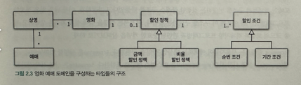
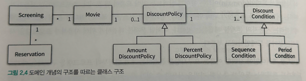

# 협력, 객체, 클래스

- 객체지향은 객체를 지향하는 것이다.
- 나는 평소 프로그램을 작성할때, 어떤 Class 가 필요하겠네. 라고 먼저 떠올린다

> 안타깝게도, 이것은 객체지향의 본질과는 거리가 멀다. 객체지향은 말 그대로 객체를 지향하는 것이다.  
> 진정한 객체지향 패러다임으 전환은 클래스가 아닌 객체에 초점을 맞출 때에만 얻을 수 있다.  

### 어떤 클래스가 필요한지를 고민하기 전에 어떤 객체들이 필요한지 고민하기.
- 클래스는 공통적인 상태와 행동을 공유하는 객체들을 추상화 한 것이다.
- 클래스의 윤곽을 잡기 위해선, 어떤 객체들이 어떤 상태와 행동을 가지는지를 먼저 결정해야 한다.
- 객체를 중심에 두는 접근 방법은 설계를 단순하고 깔끔하게 만든다.

### 객체를 독립적인 존재가 아니라 기능을 구현 하기 위해 협력하는 공동체의 일원으로 바라보자.
- 홀로 존재할수 없다.
- 다른 객체에게 도움을 주거나, 의존하면서 살아가는 협력적인 존재다.

### 도메인의 구조를 따르는 프로그램 구조
- 도메인(domain) 이라는 용어를 살펴보는 것이 도움이 될 것이다.
- 소프트웨어는 사용자가 원하는 어떤 문제를 해결하기 위해 만들어진다.
> 영화 예매 시스템의 목적은 영화를 좀 더 쉽고 빠르게 예매하려는 사용자의 문제를 해결하는것이다.  
> 문제를 해결하기 위해 사용자가 프로그램을 사용하는 분야를 도메인 이라고 부른다.  

### 객체지향 패러다임이 강력한 이유
- 요구사항을 분석하는 초기 단계 부터 프로그램을 구현하는 마지막 단계까지 객체라는 동일한 추상화 기법을 사용할 수 있기 때문.
- 요구사항과 프로그램을 객체라는 동일한 관점에서 바라볼 수 있기 때문에 도메인을 구성하는 개념들이 프로그램의 객체와 클래스로 매끄럽게 연결

### 영화 예매 도메인을 구성하는 개념과 관계를 표현

- 영화는 여러 번 상영될 수 있다
- 상영은 여러 번 얘매될 수 있다
- 영화에는 할인 정책을 할당 하지 않거나 할당하더라도 오직 하나만 할당할 수 있다.
- 할인 정책이 존재하는 경우에는 하나 이상의 할인 조건이 반드시 존재한다.
  - 할인 정책의 종류로는 금액 할인 정책과 비율 할인 정책이 있다.
  - 할인 조건의 종류로는 순번 조건과 기간 조건이 있다.

### 도메인의 구조와 유사한 형태로 작성한 클래스 구조

