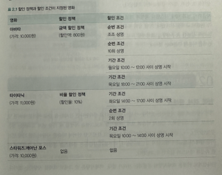

# 객체지향 프로그래밍

### 01 영화 예매 시스템

### 규칙
- 할인액 을 결정하는 두가지 규칙
  - 할인 조건 (discount condition)
  - 할인 정책 (discount policy)

#### 할인 조건
- 가격의 할인 여부를 결정하며 '순서 조건' 과 '기간 조건' 의 두 종류로 나눌 수 있다.
  - 순서 조건(sequence condition) 은 상영 순번을 이용해 할인 여부를 결정하는 규칙이다.
    - 순서 조건의 순번이 10 인 경우 매일 10번째로 상영되는 영화를 예매한 사용자들에게 할인 해택을 제공한다.
  - 기간 조건(period condition) 은 영화 상영 시작 시간을 이용해 할인 여부를 결정.
    - 특정 요일, 시작 시간, 종료 시간의 세 부분 으로 구성됨
      - 요일
        - 특정 요일
      - 시작 시간
        - 오전 10시
      - 종료 시간
        - 오후 1시
> 영화 시작 시간이 '아래' 의 해당 기간 안에 포함될 경우 요금을 할인 한다.  
> 매주 월요일 오전 10시 부터 오후 1시 사이에 상영되는 모든 영화 는 할인 혜택 대상.  

### 할인 정책
- 금액 할인 정책 (amount discount policy)
  - 예매 요금에서 일정 금액을 할인
- 비율 할인 정책 (percent discount policy)
  - 정가에서 일정 비율의 요금을 할인해 주는 방식

> 금액 할인 정책 e.g )   
> - 영화의 가격이 9,000 원 일 경우, 금액 할인 정책이 800 원일 경우 일인당 예매 가격은 9,000 원에서 800 원을 뺀 8,200 원  

> 비율 할인 정책 e.g)  
> - 영화 가격 이 9000 원 일 경우, 비율 할인 정책이 10% 일 경우 일인당 예매 가격은 900 원이 할인된 8,100 원
>   - 비율 공식 : 영화가격 - (영화가격 / 10)

